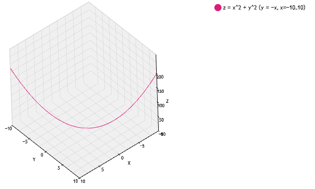

Getting Started
===============

.. _import-docs:

Installation
------------
Download the latest version of Elegans from `here <https://raw.githubusercontent.com/domitry/elegans/master/release/elegans.min.js>`_. Then copy and paste code below to your html file.

.. code-block:: html

		
		
		

Preparing Data
--------------
There are two input formats of vertexes, Matrix and Array.

------
Matrix
------

Matrix format is looks like return value of `Numpy.meshgrid <http://docs.scipy.org/doc/numpy/reference/generated/numpy.meshgrid.html>`_.
Surface and Wireframe support this format.

.. code-block:: javascript

		var data = 
		{x:[
		[1,1,1],
		[2,2,2],
		[3,3,3]
		],
		y:[
		[1,2,3],
		[1,2,3],
		[1,2,3]
		],
		z:[
		[1,2,3],
		[4,5,6],
		[7,8,9]
		]};

------
Array
------

In Array format, the set of 3 values that have the same index in x,y,z array indicates 1 vertex.
Line, Particles and Scatter support this format.

.. code-block:: javascript

		var data = {x:[1,2,3],y:[1,2,3],z:[1,2,3]};

Quick plotting
--------------

You can quickly generate plots in method-chain style, with d3.js selector. 

.. code-block:: javascript

		d3.select("#vis").datum(data).call(Elegans.LinePlot.thickness(5).colors(["#dd1c77","#dd1c77"]));

`Sample code here <http://bl.ocks.org/domitry/11394091>`_

Multiple plotting
----------------------

When you need to put multiple plots in one 3-dimentional space, you can write code like below.

.. image:: images/multiple_plot.png
.. code-block:: javascript

		var stage = new Elegans.Stage(d3.select("#vis")[0][0]);
		var line = new Elegans.Line(line_data, {thickness: 5, colors: ["#dd1c77","#dd1c77"]});
		var particles = new Elegans.Particles(particles_data, {size: 0.8, color: "#c994c7"});
		stage.add(line);
		stage.add(particles);
		stage.render();

`Sample code here <http://bl.ocks.org/domitry/11394203>`_

Embedding Elegans into your library
---------------------------

Elegans has API to make it easier to embed it into various environments except browsers, like IPython notebook. 
What you need to do is only to generate simple JSON object, and embed it into static html templates like below.

.. code-block:: javascript

   var model = {
   charts:[{type:"Particles",data:{x:[1,2,3],y:[1,2,3],z:[1,2,3]},options:{color:"#000000"}}],
   options:{width:500, height:500}
   };
   Elegans.Embed.parse(model, "#vis");
